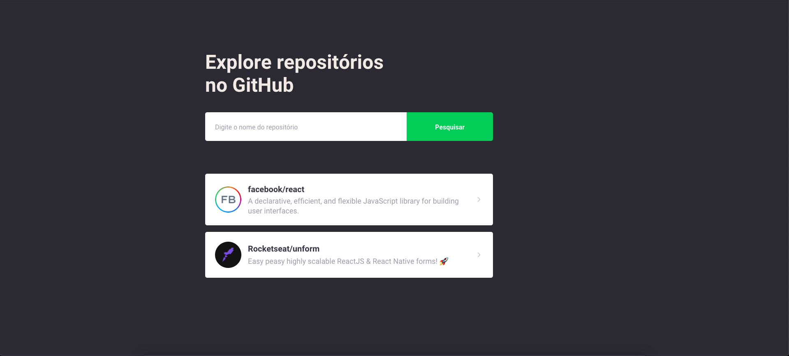
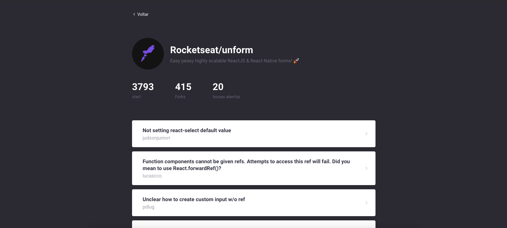

<h1 align="center">
  GitHub Explorer GraphQL
</h1>

<p>
  Projeto voltado para o aprendizado de graphql utilizando React, Apollo Client.
</p>

## 🚀 Tecnologias

- [React](https://reactjs.org)
- [TypeScript](https://www.typescriptlang.org/)
- [Node.js](https://nodejs.org/en/)
- [GraphQL](https://graphql.org/)
- [Apollo GraphQL](https://www.apollographql.com/)

<br />

<div>
  
</div>

<br />

## Instalações e usos

Clone ou faça o downlod desse repositório:

```
# Clone o repositório
$ git clone https://github.com/rafaelone/GithubExplorer-GraphQL
```

Acesse a pasta e faça as instalações:

```
# Acesse a pasta do frontend
$ cd GithubExplorer-GraphQL/

# Instale as dependencias
$ yarn

# Rode
$ yarn start

```

### Próximos passos

Utilizar subscriptions para fica atualizando em tempo real sempre que uma issue for aberta.

<br />
<br />

👩🏻‍💻 **Rafael Sergio**

[](https://github.com/rafaelone)
[](https://www.linkedin.com/in/rafael-sergio-982951103/)
